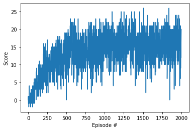
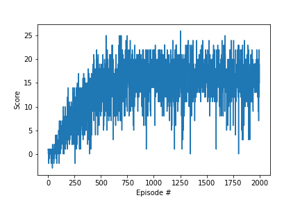
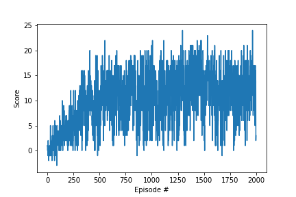
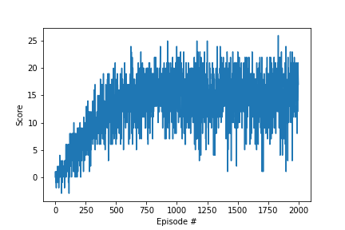
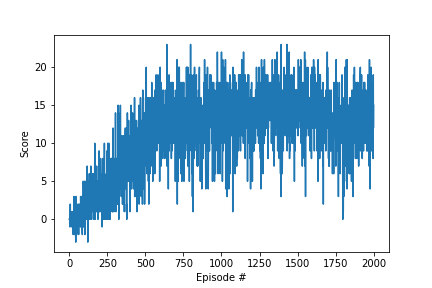
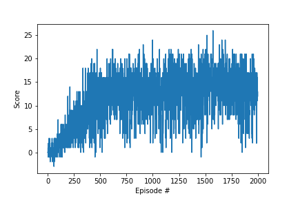
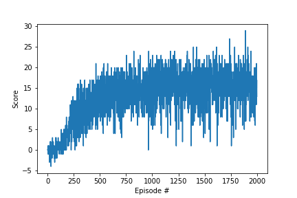
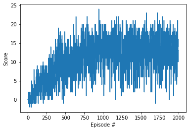
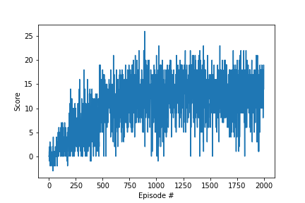

# Report
This is the report of my experiments in training several agents. 

## Learning algorithm
I implemented a DQN agent starting from the exercise in the previous DQN lessons on this Udacity nanodegree. I tried different combinations of parameters and added a Double DQN to compare it with a single DQN.

The model is a set of fully connected layers (1 or 2 in my experiments) that connect the 37 state variables with the 4 possible actions.

The agent makes use of an epxerience replay buffer from where it randomly samples previous `(state, action, reward, next_state)` tuples to build the batch for training.

### Set of parameters
I selected 6 parameter combinations as shown in the table below.

| Name     | Nodes in layers             | Buffer size | Batch size | Gamma | Tau   | Learning rate | Update every |
|----------|-----------------------------|-------------|------------|-------|-------|---------------|--------------|
| `param1` | 2 layers with 64 nodes each | 100000      | 64         | 0.99  | 0.001 | 0.0005        | 4            |
| `param2` | 2 layers with 64 nodes each | 1000        | 64         | 0.99  | 0.001 | 0.0005        | 4            |
| `param3` | 2 layers with 64 nodes each | 100000      | 128        | 0.99  | 0.001 | 0.0005        | 4            |
| `param4` | 2 layers with 8 nodes each  | 100000      | 64         | 0.99  | 0.001 | 0.0005        | 4            |
| `param5` | 1 layer with 32 nodes       | 100000      | 64         | 0.99  | 0.001 | 0.0005        | 4            |
| `param6` | 1 layer with 8 nodes        | 100000      | 64         | 0.99  | 0.001 | 0.0005        | 4            |

I started with the exact set of parameters from the previous lessons.

Then I tried to reduce the buffer size and increase the batch size to see how the laarning curve changes.

I also made the learning rate 100 times larger but the agent could not learn anything and I did not include that in my parameter combinations. The same result came from reducing the discount factor Gamma to 0.2.

After setting buffer size, batch size, gamma, tau, learning rate and update frequency the same as the previous lesson, I played with the neural network structure by reducing the number of nodes in the initial 2 layers and going to only 1 fully connected layer with a small number of nodes.

## Results
I trained all the 6 parameters combinations with single DQN and `param1`, `param4` and `param6` with Double DQN for 2000 episodes (1000 steps max per episode), storing the fully trained checkpoints and the checkpoints from the earliest successful episode (i.e. the first time that 100 consecutive episodes had an average score greater than 13). After the training I watched the earliest and fully trained models for 3 times and record those scores. Results are in the table below.

| Name          | Episode solving the environment | Plot of rewards      | Scores of 3 runs with the earliest model | Scores of 3 runs with the fully trained model | 
|---------------|---------------------------------|--------------------- |------------------------------------------|-----------------------------------------------|
| `param1`      | 446                             |       | [16.0, 18.0, 16.0]                       | [12.0, 22.0, 16.0]                            |
| `param1_ddqn` | 390                             |  | [17.0, 10.0, 5.0]                        | [12.0, 15.0, 11.0]                            |
| `param2`      | 1320                            |       | [5.0, 11.0, 15.0]                        | [13.0, 14.0, 11.0]                            |
| `param3`      | 403                             |       | [12.0, 17.0, 18.0]                       | [18.0, 17.0, 13.0]                            |
| `param4`      | 817                             |       | [21.0, 0.0, 17.0]                        | [7.0, 15.0, 16.0]                             |
| `param4_ddqn` | 546                             |  | [17.0, 18.0, 11.0]                       | [16.0, 14.0, 18.0]                            |
| `param5`      | 817                             |       | [16.0, 13.0, 18.0]                       | [13.0, 17.0, 16.0]                            |
| `param6`      | 817                             |       | [3.0, 10.0, 1.0]                         | [11.0, 12.0, 16.0]                            |
| `param6_ddqn` | 546                             |  | [12.0, 7.0, 11.0]                        | [6.0, 20.0, 15.0]                             |

## Future work
